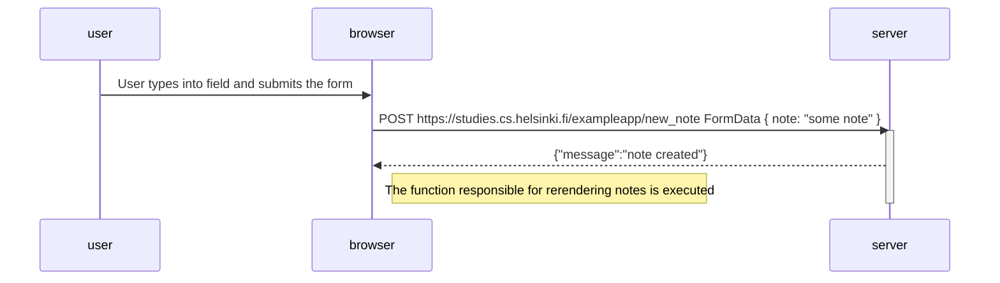

```mermaid
sequenceDiagram
  participant user
  participant browser
  participant server

  user->>browser: User types into field and submits the form
  browser->>server: POST https://studies.cs.helsinki.fi/exampleapp/new_note FormData { note: "some note" }
  activate server
  server-->>browser: {"message":"note created"}
  Note right of browser: The function responsible for rerendering notes is executed
  deactivate server
```
